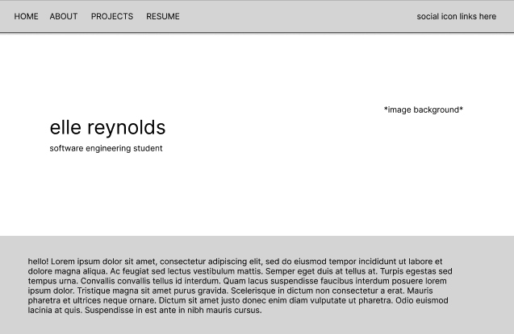
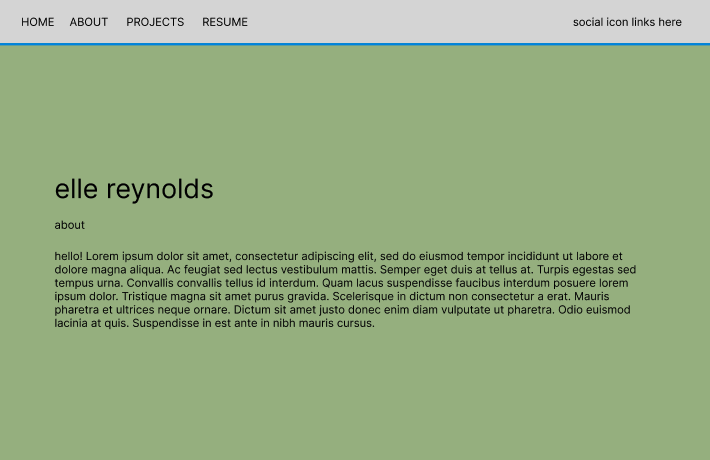
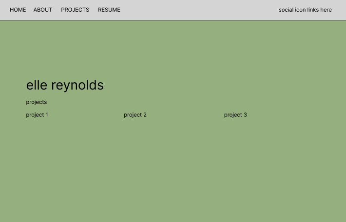
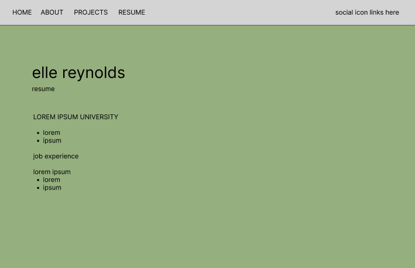
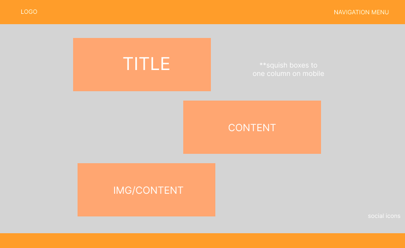

# Portfolio-1

# Technologies Used
- HTML, CSS & JavaScript

# Installation Instructions 
Option 1: 
- Open https://ellereyy.github.io/Portfolio-1/index.html in your browser 

Option 2: 
- Clone this repository to your local machine & view on VS code preview

# User Stories 
- As a small business owner, I want to see a portfolio that demonstrates web development skills and design cohesiveness so it helps me determine if I should work with Elle. 
- As a hiring manager, I want to see a portfolio that displays a range of skills along with creativity so it helps confirm hiring decisions. 

# Wire Frames
Original Designs 

 
 
 
 

Updated design - developed after first iteration looked too plain 

# Unsolved Problems / Major Hurdles

*Page transitions - hurdle*
- I struggled a lot to get the page transitions to work the way that I had initially envisioned. After multiple rounds of trial and error (and spending way too much time on the issue), I decided to alter my desired outcome and changed my plan from a sliding page transition to a fade transition. 
- By the time I had figured out a solution, I decided it wasn't worth the time commitment and kept my more simple fade transition. 

*CSS - hurdle*
- CSS ended up being much more difficult than I anticipated
- I started by styling a lot of individual elements in my HTML instead of creating classes that all elements would fit into 
- I ended up scrapping my initial CSS page and started over with a more structured approach, but still found myself falling back into my prior tendency of individually formatting single elements 
    - This caused a series of issues in formatting throughout the pages, as I accidentally triggered changes in places I didn't plan for 
    - I had to scrape through my CSS file and clean it up and find errors multiple times 

*Linking Hangman - Unsolved Problem*
- In linking my hangman game, I struggled to get the pathnames to work for the changing images. For the rest of my site, I used URLs instead of pathnames to isolate certain JS functions. 
- However, I wasn't able to finalize this in my hangman images since each image didn't have a separate URL. 

# Citations 
<a href="https://www.flaticon.com/free-icons/parachute" title="parachute icons">Parachute icons created by Dreamstale - Flaticon</a>

<a href="https://www.w3schools.com/"> W3 Schools</a>

<a href="https://developer.mozilla.org/en-US/">Developer.Mozilla</a>